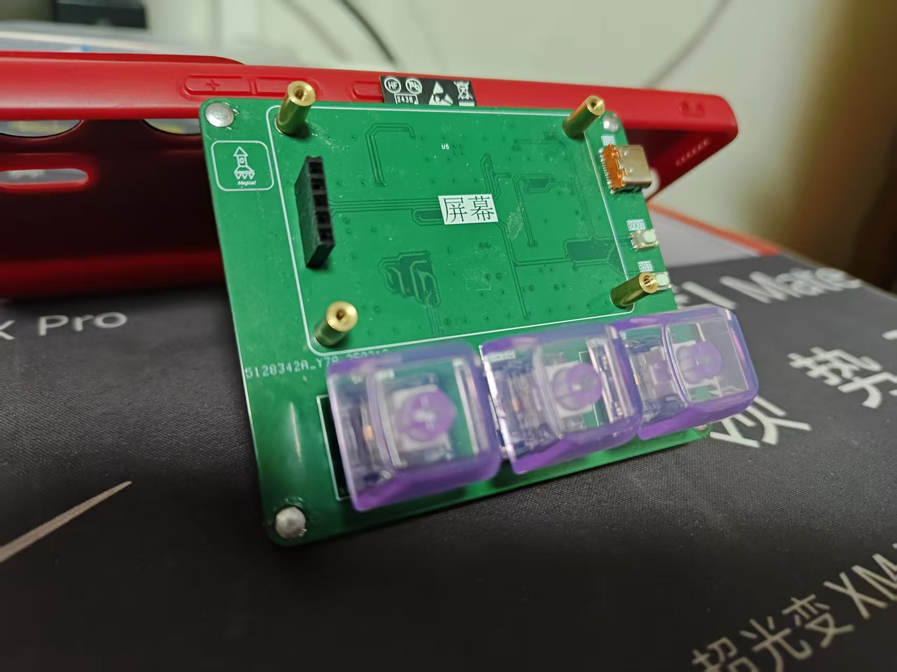

# 
# 🤔这是什么？
- 这是存储KeyTool的嵌入式程序,与上位机程序的源代码仓库
- 硬件设备开源地址:[点击跳转](https://oshwhub.com/mofa1hao/an-jian-gong-ju-ver0-1)

- 嵌入式程序详情:[点击跳转](KeyTool_embedded/README_esp.md)

- 上位机程序详情:[点击跳转](KeyTool_Upper_computer/README_qt.md)
# 📂文件夹说明

- KeyTool_embedded         基于ESPIDF的嵌入式程序
- KeyTool_Upper_computer   基于Qt quick的上位机程序
- Readme_need_file          README文件需要的资源
- remove_build              用于删除build的源代码
- remove_build.exe          用于删除build文件夹的脚本